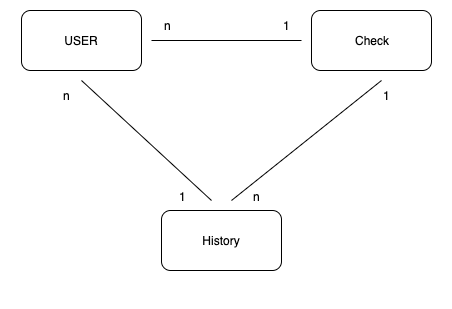
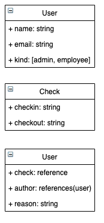

# Check

## Descripción del problema

Desarrollar un sistema para entrada y salida de empleados.
Requerimientos funcionales:
- Inicio de sesión de administrador de la empresa
- Inicio de sesión de empleado
- El administrador puede marcar la entrada y salida de sus empleados
- El administrador gestione los reportes de entrada y salida de sus empleados
- El administrador gestione la información de empleados
- El empleado revise su reporte de entrada y salida
Consideraciones:
- Backend en Ruby on Rails v5.2
- API debe estar documentado
- Usar PostgreSQL
- Aplicar Unit testing o testing funcional
- El criterio del postulante será el punto más importante a evaluar.


## Solución propuesta

Generar un esquema de la siguiente forma:
<p align="center">


</p>

Se realizó la autenticación con JWT, asociando un token para sesión, con 8 horas de vida.
La autenticación se realiza obteniendo el Token del endpoint /auth/login, especificando en la cabecera Authorization.


En lib/json_web_token.rb se generó los métodos para generar el codificación y decodificación del token, necesario para el acceso a los endpoints.

Se generó desde ApplicationController el método a utilizar en los endpoints para validar el token del request. En este método, se utilizan los definidos en json_web_token.rb


Se generó una entidad User su rol definido como el atributo kind, más adelante se pensaba realizar una especificación de permisos, ingresando un método como helper en los controladores en el que por cada endpoint se especifica el rol de usuario en el cuál está permitido el acceso

Helper

```
  def authorize!(array)
    unless array.include? @current_user.kind
      render status: :forbidden
    end
  end
```
En endpoints de controller
```
…
 authorize!([admin, employee])
…
```

### Los endpoints realizados


- POST /auth/login  -> Inicio de sesión
- DELETE /auth/logout  -> Cierre de sesión
- PUT /check - marcado de checkin/checkout


### Los endpoints faltantes

- GET /checks/:user_:id [Admin, Amployee]  - Para consulta de los checkers generados por las marcas checkin-checkout del usuario.
- PUT /checks/:user_id/:check_id [Admin] - Como administrador se especifica la edición del check de algún empleado, esto por la necesidad de indicar algún error o falta de algún employee. Sin la opción de editar los checks propios. Se solicita un texto de justificación para el cambio. Cada modificación realizada en este endpoint, generaba un registro History ligado al usuario que modificó (author). Se podría modificar en el mismo request checkin y checkout del check registrado.
- DELETE /checks/:user_id/:check_id [Admin]- En el caso de que se requiera eliminar algún check (in y out) se especifica la razón y se elimina. Se utiliza soft_delete para que la consistencia del histórico no sea afectada, ya que la eliminación implica también una entrada como History y se requiere una razón.
- GET /checks/:user_id/history/:check_id [Admin, Employee] - Como cualquier usuario, consultar el historial de un check en específico.


- GET /users/:id [Admin, Employee] - Para consulta de datos de usuarios. Si el usuario es Employee, sólo se le deja consultar su información
- POST /users [Admin] - Creación de usuarios (Empleado o Admin).
- PUT /users/:id [Admin] -  Para editar información de un usuario.
- DELETE /users/:id [Admin] - Para eliminar usuario. El usuario consultor no es posible eliminarse a sí mismo.

### Credenciales de acceso

Ejecutar
```
rake db:seed
```
Usuario en seed:
email: alberto@gmail.com
password: 123456789 d

### Vagrant
Para crear maquina virtual para ejecutar el proyecto
```
vagrant up posgres
```

 Configurar Secrets.yml para realizar la conexión con la base de datos.
